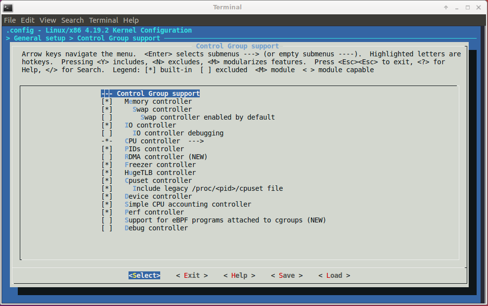

# cgroups

### Contents

<!-- MarkdownTOC -->
[1. What's cgroups?](#-what-is-cgroups)  
[2. How to use cgroups?](#-how-to-use-cgroups)  
[3. References](#-references)   
<!-- /MarkdownTOC -->

<a name="-what-is-cgroups"><a/>
### 1. What's cgroups?

`cgroups` stands for **Control Groups**, it's a feature of Linux kernel that allocates and isolates resources: CPU, memory, disk I/O and networking of one or more processes.  
The below figure shows the configurations of `cgroups` in Linux kernel:


The design of `cgroup` aims to provide a unified interface to manage processes or OS-level virtualization, including `Linux Containers` (LXC):  
* **Resource limiting:** a group can be configured not to exceed a specified memory limit or use more than the desired amount of processors or be limited to specific peripheral devices. 
* **Prioritization:**  one or more groups may be configured to utilize fewer or more CPUs or disk I/O throughput. 
* **Accounting:** a group's resource usage is monitored and measured.  
* **Control:** groups of processes can be frozen or stopped and restarted.  

<a name="-how-to-use-cgroups"><a/>
### 2. How to use cgroups?

The user can access and manage cgroups directly and indirectly (with `LXC`, `libvirt` or `Docker`).  
Install the necessary packages:
```sh
$ sudo apt-get install libcgroup1 cgroup-tools
```
Now, the enabled `cgroups` can be seen via `proc filesystem` or `sysfs`:
```sh
$ cat /proc/cgroups

#subsys_name    hierarchy       num_cgroups     enabled
cpuset  9       2       1
cpu     4       134     1
cpuacct 4       134     1
blkio   7       134     1
memory  5       163     1
devices 11      134     1
freezer 2       2       1
net_cls 3       2       1
perf_event      10      2       1
net_prio        3       2       1
hugetlb 8       2       1
pids    6       136     1

$ ls -l /sys/fs/cgroup/

total 0
dr-xr-xr-x 6 root root  0 Nov 13 00:55 blkio
drwxr-xr-x 2 root root 60 Nov 13 01:00 cgmanager
lrwxrwxrwx 1 root root 11 Nov 13 00:55 cpu -> cpu,cpuacct
lrwxrwxrwx 1 root root 11 Nov 13 00:55 cpuacct -> cpu,cpuacct
dr-xr-xr-x 6 root root  0 Nov 13 00:55 cpu,cpuacct
dr-xr-xr-x 3 root root  0 Nov 13 00:55 cpuset
dr-xr-xr-x 6 root root  0 Nov 13 00:55 devices
dr-xr-xr-x 3 root root  0 Nov 13 00:55 freezer
dr-xr-xr-x 3 root root  0 Nov 13 00:55 hugetlb
dr-xr-xr-x 6 root root  0 Nov 13 00:55 memory
lrwxrwxrwx 1 root root 16 Nov 13 00:55 net_cls -> net_cls,net_prio
dr-xr-xr-x 3 root root  0 Nov 13 00:55 net_cls,net_prio
lrwxrwxrwx 1 root root 16 Nov 13 00:55 net_prio -> net_cls,net_prio
dr-xr-xr-x 3 root root  0 Nov 13 00:55 perf_event
dr-xr-xr-x 6 root root  0 Nov 13 00:55 pids
dr-xr-xr-x 6 root root  0 Nov 13 00:55 systemd
```
`cgroups` can be configured directly via the `sysfs`. For example, let's create a small bash script named **test_cgroups.sh** for demonstration:
```sh
#!/bin/bash

while :
do
    echo "Print line" > /dev/tty
    sleep 5
done
```
Run above script:
```sh
$ chmod +x test_cgroups.sh
$ ./test_cgroups.sh
Print line
Print line
Print line
...
...
```
Change directory to `/sys/fs/cgroup/devices` where `devices` represents kind of resources that allows or denies access to devices by tasks in a `cgroup`:
```sh
$ cd sys/fs/cgroup/devices
```
Then, create a directory `cgroups_test_group`:
```
# mkdir cgroups_test_group
```
After creation of the `cgroups_test_group` directory, the following files will be generated:
```sh
$ ls -l /sys/fs/cgroup/devices/cgroups_test_group

total 0
-rw-r--r-- 1 root root 0 Nov 16 02:05 cgroup.clone_children
-rw-r--r-- 1 root root 0 Nov 16 02:05 cgroup.procs
--w------- 1 root root 0 Nov 16 02:05 devices.allow
--w------- 1 root root 0 Nov 16 02:05 devices.deny
-r--r--r-- 1 root root 0 Nov 16 02:05 devices.list
-rw-r--r-- 1 root root 0 Nov 16 02:05 notify_on_release
-rw-r--r-- 1 root root 0 Nov 16 02:05 tasks
```
The `tasks` file contains PIDs (Process ID) of processes which will be attached to the `cgroups_test_group`, the `devices.deny` file contains list of denied devices. By default, a newly created group has no any limits for devices access. In order to forbid a device (in this case, it's `/dev/tty`), the `devices.deny` file should be modified:
```
# echo "c 5:0 w" > devices.deny
```
In the above command, the `c` indicates that `/dev/tty` is a character device, `5:0` is major and minor numbers of the device. The last `w` is write permission, so the above command forbids tasks to write to the `/dev/tty`.
```sh
$ ls -l /dev/tty

crw-rw-rw- 1 root tty 5, 0 Nov 18 17:02 /dev/tty
```
After that, re-run the script `test_cgroups.sh`:
```sh
$ ./test_cgroups.sh
Print line
Print line
Print line
...
...
```
then add the PID of this process to the `tasks` file:
```
# echo $(pidof -x test_cgroups.sh) > /sys/fs/cgroup/devices/cgroups_test_group/tasks
```
The result will be as expected:
```
$ ./test_cgroups.sh
Print line
Print line
Print line
./test_cgroups.sh: line 5: /dev/tty: Operation not permitted
./test_cgroups.sh: line 5: /dev/tty: Operation not permitted
...
...
```
An other example when running [`docker container`](https://www.docker.com/resources/what-container)
```sh
$ docker ps
CONTAINER ID        IMAGE               COMMAND             CREATED             STATUS              PORTS
98225055fa39        ubuntu              "/bin/bash"         47 seconds ago      Up 30 seconds

$ cat /sys/fs/cgroup/device/docker/98225055fa394b388e988b067b77dda61e53027ee944e4e0fd7887e19cdcf341/tasks
13556
```
During starting up of a `docker container`, `docker` creates a `cgroup` for processes in this container:
```sh
$ docker run -it ubuntu
$ top
  PID USER      PR  NI    VIRT    RES    SHR S  %CPU %MEM     TIME+ COMMAND
   1  root      20   0   18508   1848   1444 S   0.0  0.0   0:00.01 bash
   12 root      20   0   36628   1924   1420 R   0.0  0.0   0:00.01 top
```
Now, the `cgroup` of above process will be seen on host machine:
```sh
$ systemd-cgls
Control group /:
-.slice
├─1429 /sbin/cgmanager -m name=systemd
├─docker
│ └─98225055fa394b388e988b067b77dda61e53027ee944e4e0fd7887e19cdcf341
│   └─13556 /bin/bash
```

<a name="-references"><a/>
### 3. References
[1] [Linux Control Groups](https://www.linuxjournal.com/content/everything-you-need-know-about-linux-containers-part-i-linux-control-groups-and-process)
