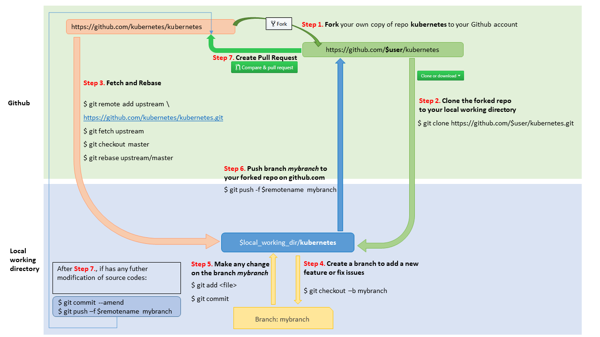
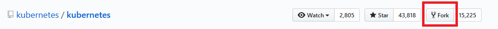

# Github workflow

### Contents

<!-- MarkdownTOC -->
[1. Big picture](#-big-picture)  
[2. Fork a repository](#-fork-a-repository)  
[3. Clone fork repository to local](#-clone-fork-repository-to-local)  
[4. Create a branch to add a new feature or fix issues](#-create-a-branch)  
[5. Commit and Push](#-commit)   
[6. Create a Pull Request](#-create-a-pull-request)   
<!-- /MarkdownTOC -->

<a name="-big-picture"><a/>
### 1. Big picture


<a name="-fork-a-repository"><a/>
### 2. Fork a repository
* Goto https://github.com/kubernetes/kubernetes
* Hit the `Fork` button to fork your own copy of repo **kubernetes** to your github account


<a name="-clone-fork-repository-to-local"><a/>
### 3. Clone the forked repository to local

Clone the forked repo in [above step](#2-fork-a-repository) to your local working directory:
```sh
$ git clone https://github.com/$user/kubernetes.git

$ cd kubernetes

$ git remote add upstream https://github.com/kubernetes/kubernetes.git

# Never push to upstream master
$ git remote set-url --push upstream no_push

# Confirm that your remotes make sense:
$ git remote -v
```
`$user` = {your github account name}

<a name="-create-a-branch"><a/>
### 4. Create a branch to add a new feature or fix issues

Update local working directory:

```sh
$ cd kubernetes

$ git fetch upstream

$ git checkout master

$ git rebase upstream/master
```

> Please don't use `git pull` instead of `git fetch / rebase`. `git pull` does a merge, which leaves merge commits. These make the commit history messy and violate the principle commits.

Create a new branch:
```sh
$ git checkout -b mybranch
```

<a name="-commit"><a/>
### 5. Commit and Push

##### Commit

Make any change on the branch `mybranch` then build and test your codes.  
Include in what will be committed:
```sh
$ git add <file>
```
Commit your changes:
```sh
$ git commit
```
Enter your commit message to describe the changes. See the tips for a good commit message at [here](https://chris.beams.io/posts/git-commit/).  
Likely you go back and edit/build/test some more then `git commit --amend`

##### Push

Push your branch `mybranch` to your forked repo on github.com.
```sh
$ git push -f $remotename mybranch
```

<a name="-create-a-pull-request"><a/>
### 6. Create a Pull Request

- Go to your fork at https://github.com/$user/kubernetes
- Hit the button  next to branch `mybranch`
- Flow the following processes to create a new pull request
